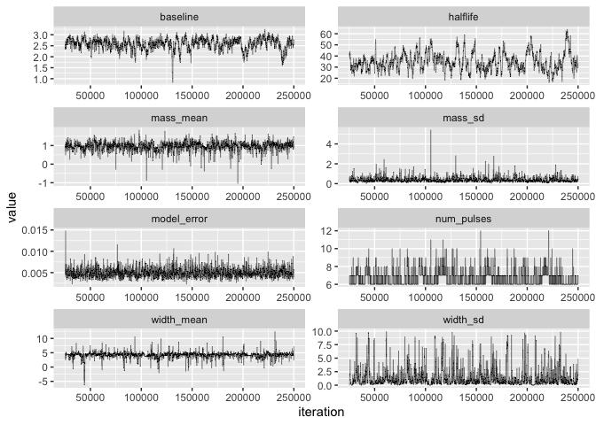

A Markov chain Monte Carlo fit is only trustworthy once the chains have
forgotten their starting values and are exploring the posterior. We assess that
with three complementary tools: trace plots (a visual check of mixing),
the effective sample size (how many independent draws the chain is really
worth), and the Gelman-Rubin statistic (agreement across several independent
chains). In this single-subject model the elimination half-life is the hardest
parameter to sample, and the diagnostics below show that honestly rather than
hiding it.

## Run several chains

The Gelman-Rubin diagnostic compares independent chains, so we fit the same
model four times from different random seeds. (This chunk is precomputed offline
via `vignettes/precompute.R`, so the vignette itself builds quickly.)

This is the same simulated series and specification used in the getting-started
vignette -- the lognormal parameterization, with the mass and width arguments
left at their tuned log-scale defaults.


``` r
simdat <- {set.seed(2026); simulate_pulse(num_obs = 60, interval = 10,
            error_var = 0.005, ipi_mean = 12, ipi_var = 10, ipi_min = 4,
            pulse_distribution = "lognormal",
            mass_mean = 0.9, mass_sd = 0.3, width_mean = 4.6, width_sd = 0.3,
            constant_halflife = 40, constant_baseline = 2.5)}
spec <- pulse_spec(
  location_prior_type    = "strauss",
  prior_location_gamma   = 0.1,  prior_location_range = 30,
  prior_halflife_mean    = 38,   prior_halflife_var   = 1000,
  prior_baseline_mean    = 2.25, prior_baseline_var   = 100,
  prior_mean_pulse_count = 10,
  sv_baseline_mean = 2.5, sv_halflife_mean = 42, sv_error_var = 0.005,
  pv_pulse_location = 5)

fits <- lapply(1:4, function(k) {
  set.seed(100 + k)
  fit_pulse(data = simdat$data, spec = spec,
            iters = 250000, thin = 100, burnin = 25000, verbose = FALSE)
})
#> Location prior is: strauss
#> mcmc iterations = 250000
#> thin = 100
#> burnin = 25000
#> Location prior is: strauss
#> mcmc iterations = 250000
#> thin = 100
#> burnin = 25000
#> Location prior is: strauss
#> mcmc iterations = 250000
#> thin = 100
#> burnin = 25000
#> Location prior is: strauss
#> mcmc iterations = 250000
#> thin = 100
#> burnin = 25000
```

## Trace plots

A well-mixed chain looks like a fuzzy, stationary horizontal band; a chain that
drifts or gets stuck has not converged. `bp_trace()` shows every parameter for
one fit at once.


``` r
bp_trace(fits[[1]])
```



## Effective sample size

Successive MCMC draws are correlated, so the saved samples are worth fewer
*independent* draws than their raw count. The effective sample size (ESS)
estimates that effective count; as a rough guide, an ESS in the low hundreds is
adequate for stable posterior means and intervals.


``` r
params <- c("baseline", "halflife", "mass_mean", "width_mean",
            "mass_sd", "width_sd")
ess_tbl <- sapply(params, function(p)
  effective_sample_size(patient_chain(fits[[1]])[[p]]))
round(ess_tbl, 1)
#>   baseline   halflife  mass_mean width_mean    mass_sd   width_sd 
#>      114.1       83.0      669.0      820.0     1382.1      363.6
```

The two pulse-to-pulse SD parameters, `mass_sd` and `width_sd`, are included
here deliberately. Earlier versions of the package held the width SD fixed, so
its trace was a flat line and it had no meaningful ESS; it is now estimated like
any other parameter, and is a useful canary -- because it sits on the weakly
identified mass/width ridge, it is often the first parameter to show trouble
when a chain is too short or the proposal variances are badly scaled.

## Gelman-Rubin across chains

The Gelman-Rubin statistic (often written R-hat) compares within-chain variance
to between-chain variance. Values near 1.0 indicate the chains agree and have
likely converged; values above about 1.1 are a warning sign.


``` r
gr <- sapply(params, function(p) {
  chains <- lapply(fits, function(f) patient_chain(f)[[p]])
  gelman_rubin(chains)
})
round(gr, 3)
#>   baseline   halflife  mass_mean width_mean    mass_sd   width_sd 
#>      1.003      1.003      1.000      1.000      1.000      1.000
```

Read together, these diagnostics tell a consistent story, and it is worth noting
that the two tools disagree about how much to worry. Every R-hat is essentially
1.0, so after 250,000 iterations the four chains agree with each other on all six
parameters -- by that measure the fit has converged. The effective sample sizes
are more discriminating: pulse mass and width are worth several hundred to well
over a thousand independent draws, while the half-life and the baseline come in
around an order of magnitude lower.

That gap is a real and common feature of this model, not a bug, and the two lagging
parameters are related. Baseline and half-life together determine the trough
behaviour of the series, and a slightly higher baseline paired with a slightly
shorter half-life fits the observed troughs about as well as the reverse, so the
sampler explores that ridge slowly.

The lesson generalizes: R-hat near 1.0 is necessary but not sufficient. Chains
can agree with one another and still be exploring the posterior inefficiently, so
run several chains *and* check ESS rather than treating either on its own as a
clean bill of health.

Practical remedies are to run the chain longer, thin more aggressively, or
tighten the half-life prior when physiology justifies it -- half-life is often
the parameter you genuinely do know something about in advance.

## How much of this is the prior?

When a parameter mixes poorly it is worth asking whether the posterior is being
driven by the data at all. `identifiability_check()` compares each parameter's
posterior 95% interval against the width of its prior and flags any parameter
whose posterior still spans more than half the prior support.

It accepts either a `population_fit` or a plain data frame of posterior draws, so
for a single-subject fit we hand it `patient_chain()`. The prior bounds have to
be supplied explicitly in that case; the pulse-to-pulse SDs use the default
`sd_prior = "uniform"`, so each is Uniform(0, max) with the maximum recorded in
the spec.


``` r
sd_bounds <- list(mass_sd  = c(0, spec$priors$mass_sd_max),
                  width_sd = c(0, spec$priors$width_sd_max))
identifiability_check(patient_chain(fits[[1]]), prior_bounds = sd_bounds)
#>     parameter    post_mean     post_sd         q2.5       q97.5 prior_range
#> 1  num_pulses  6.610222222 0.909210048  6.000000000  9.00000000          NA
#> 2    baseline  2.580162900 0.264945316  1.954561800  2.98848942          NA
#> 3   mass_mean  0.958956581 0.244606483  0.443484546  1.37437453          NA
#> 4  width_mean  4.215902075 1.138340700  1.452546099  5.93176458          NA
#> 5    halflife 34.919918643 8.058492656 21.817743258 53.61145169          NA
#> 6 model_error  0.004979857 0.001179986  0.003215913  0.00781798          NA
#> 7     mass_sd  0.389367136 0.280312348  0.114916625  1.06015212          10
#> 8    width_sd  1.402436745 1.784600908  0.029148972  7.28284323          10
#>   prior_coverage weak_identifiability
#> 1             NA                   NA
#> 2             NA                   NA
#> 3             NA                   NA
#> 4             NA                   NA
#> 5             NA                   NA
#> 6             NA                   NA
#> 7     0.09452355                FALSE
#> 8     0.72536943                 TRUE
```

The width SD is the parameter that gets flagged. Its posterior still covers most
of its Uniform(0, 10) prior, which says the data in a 60-observation series
sampled every 10 minutes simply do not pin down how much pulse width varies from
pulse to pulse. That is a different problem from slow mixing, and the two are
easy to confuse: a poorly mixing parameter will improve if you run the chain
longer, whereas a weakly identified one will not. The remedy there is more data,
a denser sampling schedule, a tighter prior, or an honest acknowledgement in the
write-up that the parameter is not identified from this series.

Only the parameters you give bounds for can be assessed this way -- the rest come
back as `NA`, which marks "not checked" rather than "fine".

For population models, bayespulse also provides turnkey `convergence_report()`,
`plot_trace()`, and `plot_acf()` functions; those operate on a `population_fit`
and are demonstrated in the population vignette.
