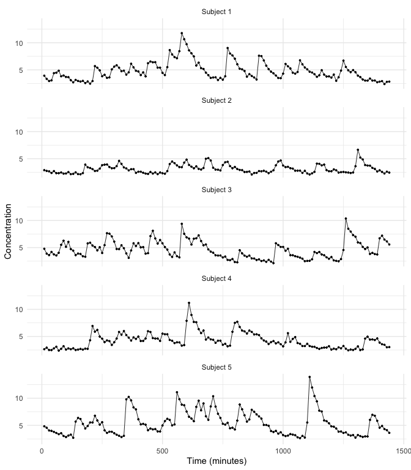
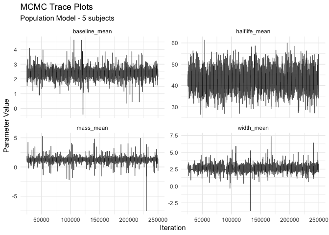
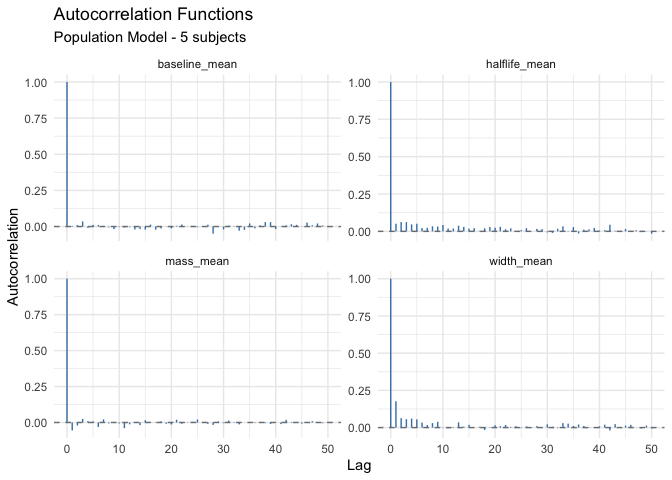
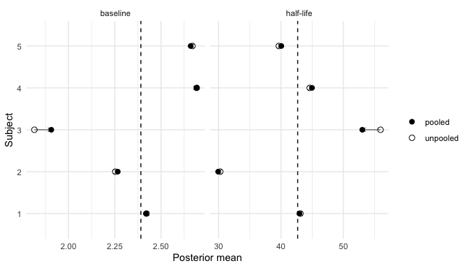

Hormone studies rarely stop at one subject. A typical protocol samples a
cohort -- five, ten, twenty people -- and the scientific questions are about
the group: what is the average pulse mass in these patients, how much do
subjects vary around it, and does this group differ from that one?

One option is to fit each subject separately, as in the getting-started
vignette, and average afterwards. That discards something valuable: subjects
inform one another. A subject whose series happens to be noisy or short can
borrow strength from the rest of the cohort, and the between-subject spread is
itself estimated with proper uncertainty instead of being computed post hoc
from a handful of point estimates. The population model does this by fitting
all subjects jointly in a single hierarchical model -- the Bayesian machinery
for *partial pooling*.

## 1. The hierarchical model

Each subject's series follows the same deconvolution model used in the
single-subject vignette: baseline plus Gaussian secretion pulses convolved
with exponential elimination, observed on the log scale with additive error.
The hierarchy enters at the subject level. Subject $i$ has its own baseline
$B_i$, half-life $H_i$, mean log pulse mass $\mu_{\alpha,i}$, and mean log
pulse width $\mu_{\omega,i}$, and these are drawn from population
distributions:

$$
B_i \sim N(\mu_B, \sigma^2_B), \qquad
H_i \sim N(\mu_H, \sigma^2_H), \qquad
\mu_{\alpha,i} \sim N(\mu_\alpha, \sigma^2_\alpha), \qquad
\mu_{\omega,i} \sim N(\mu_\omega, \sigma^2_\omega).
$$

The population means ($\mu_B, \mu_H, \mu_\alpha, \mu_\omega$) answer "what is
this cohort like on average?", and the population SDs
($\sigma_B, \sigma_H, \sigma_\alpha, \sigma_\omega$) answer "how much do
subjects differ?". Below the subject level, individual pulses vary around
their subject's means with pulse-to-pulse SDs that are shared across
subjects, as is the observation error variance.

## 2. Simulate a cohort

`simulate_pulse_population()` draws each subject's parameters from the
population distributions above and then simulates that subject's series with
`simulate_pulse()`. As in the single-subject vignettes we request
`pulse_distribution = "lognormal"` explicitly, so the simulated data match the
parameterization `population_spec()` fits by default (the simulator alone
still defaults to the legacy `"truncnorm"`).

The mass and width arguments are on the **log scale** -- we leave the
within-subject values at their tuned defaults (`mass_mean = 1.2`,
`width_mean = 3.0`) and only say how much *subjects* differ: a
`mass_mean_sd` of 0.15 means subject-level median pulse masses spread about
15% around the population median, and the baseline and half-life SDs are on
their natural scales (concentration units and minutes).


``` r
pop <- simulate_pulse_population(
  n_subjects = 5, num_obs = 144, interval = 10,
  pulse_distribution = "lognormal",
  baseline = 2.5,   baseline_sd   = 0.3,
  halflife = 40,    halflife_sd   = 5,
  mass_mean_sd = 0.15, width_mean_sd = 0.2,
  seed = 2026)
```


``` r
cohort <- do.call(rbind, lapply(seq_len(pop$n_subjects), function(i)
  cbind(subject = paste("Subject", i), pop$data[[i]])))
ggplot(cohort, aes(time, concentration)) +
  geom_line(linewidth = 0.3) + geom_point(size = 0.6) +
  facet_wrap(~ subject, ncol = 1) +
  labs(x = "Time (minutes)", y = "Concentration") +
  theme_minimal()
```



Five subjects observed every 10 minutes for 24 hours. The series share a
family resemblance -- similar pulse frequency and decay -- but differ in
level and pulse size, which is exactly the structure the hierarchy is built
to capture.

## 3. Specify the population model

`population_spec()` mirrors `pulse_spec()`, with two differences worth
noticing. First, the location priors now describe the *population
distributions*: `prior_baseline_mean_mean` and `prior_baseline_mean_var` are
the prior on $\mu_B$, and so on. Second, there are new priors on the
between-subject SDs; by default these are Uniform(0, max) with the maxima set
by `prior_baseline_sd_max` and `prior_halflife_sd_max`.

As in the single-subject vignettes we set only the data-specific arguments
and leave everything governing pulse mass and width at the tuned log-scale
defaults.


``` r
spec <- population_spec(
  location_prior_type      = "strauss",
  prior_location_gamma     = 0.1,  prior_location_range   = 30,
  prior_baseline_mean_mean = 2.6,  prior_baseline_mean_var = 100,
  prior_halflife_mean_mean = 45,   prior_halflife_mean_var = 100,
  prior_mean_pulse_count   = 12)
```

## 4. Fit the model

`fit_pulse_population()` runs the same birth-death MCMC as `fit_pulse()`, but
with all subjects updated within each iteration and the population-level
parameters updated from the subject-level values. We pass the list of
per-subject data frames straight from the simulation. (This chunk is
precomputed offline via `vignettes/precompute.R`, so the vignette itself
builds quickly; run live, a fit this long takes on the order of ten minutes,
so reduce `iters` if you are exploring interactively.)


``` r
set.seed(42)
fit <- fit_pulse_population(pop$data, spec = spec,
                            iters = 250000, thin = 50, burnin = 25000,
                            verbose = FALSE)
#> ==================================================
#> Population Model MCMC
#> ==================================================
#> Number of subjects: 5
#> Location prior: strauss
#> MCMC iterations: 250000
#> Thin: 50
#> Burnin: 25000
#> ==================================================
#> Population initialized with 5 subjects and 720 total observations
#> Starting MCMC...
#> MCMC complete!
fit
#> 
#> Population Pulse Model Fit
#> 
#> Model type: population 
#> Number of subjects: 5 
#> MCMC iterations: 250000 
#> Thinning: 50 
#> Burnin: 25000 
#> Saved samples: 4500 
#> 
#> Population-level parameters:
#> # A tibble: 6 × 12
#>   iteration mass_mean width_mean baseline_mean halflife_mean mass_mean_sd
#>       <dbl>     <dbl>      <dbl>         <dbl>         <dbl>        <dbl>
#> 1     25050      1.19       2.67          1.81          43.1        0.369
#> 2     25100      1.18       2.68          2.09          39.8        0.627
#> 3     25150      1.27       2.70          2.90          43.7        0.667
#> 4     25200      1.80       2.72          2.44          44.8        3.23 
#> 5     25250      1.04       2.84          2.24          45.1        1.78 
#> 6     25300      1.38       2.55          2.54          41.9        0.342
#> # ℹ 6 more variables: width_mean_sd <dbl>, baseline_sd <dbl>,
#> #   halflife_sd <dbl>, mass_sd <dbl>, width_sd <dbl>, errorsq <dbl>
```

## 5. Turnkey convergence diagnostics

The convergence vignette assessed a single-subject fit with the
model-agnostic tools (`effective_sample_size()`, `gelman_rubin()`). For a
`population_fit`, bayespulse provides a turnkey suite. `convergence_report()`
prints an at-a-glance summary and flags parameters whose effective sample
size is low:


``` r
report <- convergence_report(fit)
#> 
#> ====================================================================== 
#> MCMC Convergence Diagnostics Report
#> ====================================================================== 
#> 
#> Model: population 
#> Subjects: 5 
#> MCMC samples: 4500 
#> (after thinning and burnin)
#> 
#> Population-Level Parameters:
#> ---------------------------------------------------------------------- 
#> mass_mean             Mean:    1.240  SD:    0.407  ESS:   4500  ACF[1]: -0.055  [OK]
#> width_mean            Mean:    2.662  SD:    0.440  ESS:   2469  ACF[1]: 0.177  [OK]
#> baseline_mean         Mean:    2.391  SD:    0.283  ESS:   4500  ACF[1]: 0.005  [OK]
#> halflife_mean         Mean:   42.674  SD:    4.357  ESS:   3333  ACF[1]: 0.051  [OK]
#> mass_mean_sd          Mean:    0.578  SD:    0.788  ESS:   1516  ACF[1]: 0.472  [OK]
#> width_mean_sd         Mean:    0.552  SD:    0.680  ESS:   1147  ACF[1]: 0.443  [OK]
#> baseline_sd           Mean:    0.516  SD:    0.326  ESS:   4500  ACF[1]: 0.007  [OK]
#> halflife_sd           Mean:   10.701  SD:    3.796  ESS:   1883  ACF[1]: 0.109  [OK]
#> mass_sd               Mean:    0.478  SD:    0.056  ESS:   1849  ACF[1]: 0.157  [OK]
#> width_sd              Mean:    1.005  SD:    0.254  ESS:    253  ACF[1]: 0.535  [OK]
#> errorsq               Mean:    0.005  SD:    0.000  ESS:   4500  ACF[1]: 0.034  [OK]
#> 
#> Convergence Summary:
#> ---------------------------------------------------------------------- 
#> Parameters with ESS > 100: 11 / 11 (100.0%)
#> ESS range: 253 - 4500
#> Average lag-1 autocorrelation: 0.176
#> 
#> Interpretation:
#> ---------------------------------------------------------------------- 
#> [OK] Good: All parameters meet minimum ESS threshold
#> [OK] Good mixing: Low autocorrelation
#> [WARNING] Weakly identified: posterior fills most of the prior range
#>   halflife_sd      posterior 95% width covers 71% of its prior
#>   These parameters are likely poorly informed by the data;
#>   their posteriors approach the prior. Interpret with caution.
#> 
#> ======================================================================
```

The report invisibly returns the underlying table (also available directly
via `population_diagnostics()`), so you can work with it programmatically:


``` r
report[order(report$ess), c("parameter", "mean", "ess", "lag1_acf")]
#>        parameter       mean       ess     lag1_acf
#> 10      width_sd  1.0048792  252.7226  0.534875890
#> 6  width_mean_sd  0.5515189 1147.3827  0.442803338
#> 5   mass_mean_sd  0.5775454 1516.0622  0.471834338
#> 9        mass_sd  0.4779217 1848.9544  0.156813140
#> 8    halflife_sd 10.7007787 1883.4425  0.108719827
#> 2     width_mean  2.6624220 2468.5763  0.176914434
#> 4  halflife_mean 42.6737840 3332.7437  0.051015309
#> 1      mass_mean  1.2402359 4500.0000 -0.055209210
#> 3  baseline_mean  2.3910330 4500.0000  0.004543125
#> 7    baseline_sd  0.5162208 4500.0000  0.007235350
#> 11       errorsq  0.0050321 4500.0000  0.034474516
```

The pulse-to-pulse `width_sd` mixes slowest here -- the lowest effective
sample size and the highest lag-1 autocorrelation in the table -- but still
clears the ESS bar comfortably. That is the same weakly identified
mass/width ridge met in the convergence vignette, showing up at the
population level.

`plot_trace()` and `plot_acf()` accept the same `parameters` argument;
here are the four population means:


``` r
plot_trace(fit, parameters = c("baseline_mean", "halflife_mean",
                               "mass_mean", "width_mean"))
```




``` r
plot_acf(fit, parameters = c("baseline_mean", "halflife_mean",
                             "mass_mean", "width_mean"))
```



Interpretation follows the convergence vignette: fuzzy, stationary trace
bands and quickly decaying autocorrelation are what converged, efficient
sampling looks like; slowly decaying autocorrelation means the chain must run
longer for the same number of effectively independent draws.

Finally, `identifiability_check()` works on a `population_fit` directly -- it
reads the uniform-prior bounds for the between-subject SDs from the fit's own
spec, so no manual bounds are needed:


``` r
identifiability_check(fit)
#>        parameter  post_mean      post_sd         q2.5        q97.5 prior_range
#> 1      mass_mean  1.2402359 0.4069147831  0.539966694  1.915587628          NA
#> 2     width_mean  2.6624220 0.4398837381  1.856733060  3.442230693          NA
#> 3  baseline_mean  2.3910330 0.2825429763  1.809601616  2.951607619          NA
#> 4  halflife_mean 42.6737840 4.3571824523 34.180353035 51.658054503          NA
#> 5   mass_mean_sd  0.5775454 0.7883634281  0.081181036  2.788174169          10
#> 6  width_mean_sd  0.5515189 0.6803966837  0.008858276  2.266094310          10
#> 7    baseline_sd  0.5162208 0.3256987968  0.194970309  1.435348819           3
#> 8    halflife_sd 10.7007787 3.7963837539  4.788725191 18.901595264          20
#> 9        mass_sd  0.4779217 0.0557639723  0.380307476  0.601837128          10
#> 10      width_sd  1.0048792 0.2539871917  0.565297121  1.564295480          10
#> 11       errorsq  0.0050321 0.0002987527  0.004482398  0.005647533          NA
#>    prior_coverage weak_identifiability
#> 1              NA                   NA
#> 2              NA                   NA
#> 3              NA                   NA
#> 4              NA                   NA
#> 5      0.27069931                FALSE
#> 6      0.22572360                FALSE
#> 7      0.41345950                FALSE
#> 8      0.70564350                 TRUE
#> 9      0.02215297                FALSE
#> 10     0.09989984                FALSE
#> 11             NA                   NA
```

A cohort of five subjects carries only five observations' worth of
information about each between-subject SD, and the check flags exactly that:
the half-life SD's posterior still covers about 71% of its Uniform(0, 20)
prior (the same warning appears at the bottom of `convergence_report()`
above). Its effective sample size is healthy, so this is not a mixing
problem -- more subjects, not longer chains, are the remedy.

## 6. Shrinkage: what pooling buys you

To see partial pooling at work, fit each subject separately with
`fit_pulse()` -- the no-pooling analysis -- using priors that match the
population model's subject level. (Also precomputed offline.)


``` r
single_spec <- pulse_spec(
  location_prior_type    = "strauss",
  prior_location_gamma   = 0.1, prior_location_range = 30,
  prior_baseline_mean    = 2.6, prior_baseline_var   = 100,
  prior_halflife_mean    = 45,  prior_halflife_var   = 100,
  prior_mean_pulse_count = 12,
  sv_baseline_mean = 2.6, sv_halflife_mean = 45)

singles <- lapply(seq_len(pop$n_subjects), function(i) {
  set.seed(500 + i)
  fit_pulse(data = pop$data[[i]], spec = single_spec,
            iters = 250000, thin = 100, burnin = 25000, verbose = FALSE)
})
#> Location prior is: strauss
#> mcmc iterations = 250000
#> thin = 100
#> burnin = 25000
#> Location prior is: strauss
#> mcmc iterations = 250000
#> thin = 100
#> burnin = 25000
#> Location prior is: strauss
#> mcmc iterations = 250000
#> thin = 100
#> burnin = 25000
#> Location prior is: strauss
#> mcmc iterations = 250000
#> thin = 100
#> burnin = 25000
#> Location prior is: strauss
#> mcmc iterations = 250000
#> thin = 100
#> burnin = 25000
```

Now compare, for each subject, the unpooled posterior mean against the
population fit's subject-level posterior mean, with the estimated population
mean as a reference line. We show baseline and half-life -- the two
subject-level parameters on natural, directly interpretable scales; the
log-scale mass and width means shrink the same way:


``` r
est <- do.call(rbind, lapply(seq_len(pop$n_subjects), function(i) {
  unpooled <- patient_chain(singles[[i]])
  pooled   <- fit$subject_chains[[i]]
  data.frame(subject   = factor(i),
             parameter = c("baseline", "half-life"),
             unpooled  = c(mean(unpooled$baseline), mean(unpooled$halflife)),
             pooled    = c(mean(pooled$baseline),   mean(pooled$halflife)))
}))
pop_means <- data.frame(
  parameter = c("baseline", "half-life"),
  value     = c(mean(fit$population_chain$baseline_mean),
                mean(fit$population_chain$halflife_mean)))

ggplot(est, aes(y = subject)) +
  geom_vline(data = pop_means, aes(xintercept = value), linetype = "dashed") +
  geom_segment(aes(x = unpooled, xend = pooled, yend = subject),
               arrow = arrow(length = unit(0.15, "cm")), color = "grey50") +
  geom_point(aes(x = unpooled, shape = "unpooled"), size = 2.5) +
  geom_point(aes(x = pooled, shape = "pooled"), size = 2.5) +
  scale_shape_manual(NULL, values = c(unpooled = 1, pooled = 16)) +
  facet_wrap(~ parameter, scales = "free_x") +
  labs(x = "Posterior mean", y = "Subject") +
  theme_minimal()
```



Each arrow runs from the subject's unpooled estimate (open circle) to its
estimate under the population model (filled circle); the dashed line is the
estimated population mean. The population estimates sit between each
subject's own data and the cohort average -- that pull toward the center is
*shrinkage*. It is strongest for subjects whose own series pin the parameter
down least, because the population distribution then contributes relatively
more information, and mild for subjects whose data speak clearly. With 24
hours of 10-minute sampling every series here is informative, so most arrows
are short; subject 3, whose series drags the baseline lowest and the
half-life longest, shows the clearest pull back toward the cohort. With
shorter or noisier series -- common in clinical protocols -- the pooling
becomes correspondingly more valuable. The result is a principled
compromise: individual estimates stabilized by the cohort, and cohort-level
summaries ($\mu$, $\sigma$) with honest uncertainty.

## Where next

The remaining rung on the modeling ladder is the joint driver-response model
-- two coupled hormones fit simultaneously, with the driver's pulses
influencing when the response hormone fires. It is covered in the next
vignette.
