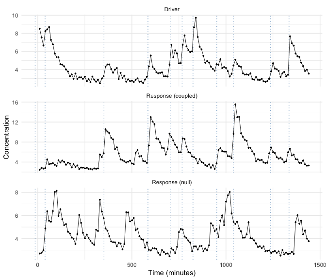
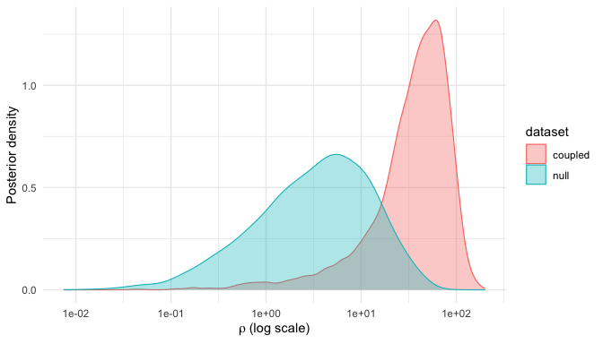
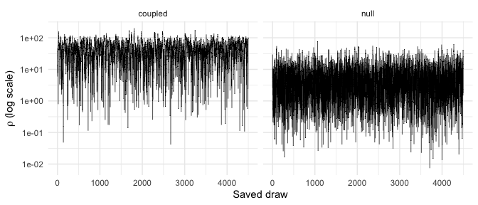

Endocrine axes are chains of command. ACTH pulses from the pituitary trigger
cortisol release from the adrenal gland; GnRH pulses drive LH; LH drives
testosterone. When both hormones of a pair can be sampled -- ACTH and
cortisol are the classic case -- a natural scientific question is causal in
flavor: *are the response hormone's pulses actually being driven by the
driver's pulses, and on what timescale?*

The joint model answers this by fitting both series at once. Each hormone
gets its own deconvolution model (as in the getting-started vignette), and
the two are coupled through the response hormone's pulse *occurrence*: a
response pulse is more likely to fire close in time to a driver pulse. This
vignette simulates a strongly driven pair and an uncoupled pair, fits both,
and shows how the coupling posterior separates them.

## 1. The coupling model

Response pulses occur as an inhomogeneous point process whose intensity is
elevated near driver pulse locations $\tau_1, \dots, \tau_{N_d}$:

$$
\mu(t) = c \left[ 1 + \lambda(t) \right],
\qquad
\lambda(t) = \sum_{j=1}^{N_d} \frac{\rho}{\sqrt{2\pi\nu}}
\, e^{-\frac{(t - \tau_j)^2}{2\nu}} ,
$$

where $c$ is a constant background rate. Two parameters describe the
coupling:

- $\rho$ (**strength**) is the *area* of each driver pulse's bump in the
  intensity. This gives it a concrete interpretation: $c \times \rho$ is the
  expected number of *extra* response pulses triggered per driver pulse.
  With a background rate of 6 pulses per 24 h ($c = 6/1440$ per minute),
  $\rho = 300$ means about $1.25$ coupling-driven response pulses per driver
  pulse -- close to one-to-one driving, as in a tightly coupled axis.
- $\nu$ (**timescale**) is the variance of the bump, so $\sqrt{\nu}$ is the
  temporal spread: $\nu = 20$ concentrates the extra firing within roughly
  $\pm 10$ minutes of each driver pulse.

Note the scale of $\rho$: because it is multiplied by the small per-minute
background rate, values in the hundreds -- not near 1 -- correspond to
physiologically meaningful coupling. A $\rho$ of 1 with this background rate
adds only $0.004$ expected response pulses per driver pulse, which no
dataset of realistic size could detect.

## 2. Simulate a coupled pair and an uncoupled pair

`simulate_pulse_joint()` simulates the driver with `simulate_pulse()` and
then places response pulses from the intensity above. As everywhere else in
this vignette series, we pass `pulse_distribution = "lognormal"` explicitly
so the simulated pulses match the parameterization `joint_spec()` fits by
default.

The two simulated datasets are identical in design except for the coupling
strength: the *coupled* pair uses $\rho = 300$, the *null* pair
$\rho = 0.01$, effectively zero (the simulator requires $\rho > 0$). The
shared `seed` is deliberate -- it makes the *driver* realization identical
in both datasets, so the pairs differ only in whether the response hormone
listens to it.


``` r
sim_coupled <- simulate_pulse_joint(
  rho = 300, nu = 20, response_pulse_count = 6,
  num_obs = 144, interval = 10,
  pulse_distribution = "lognormal", seed = 2026)

sim_null <- simulate_pulse_joint(
  rho = 0.01, nu = 20, response_pulse_count = 6,
  num_obs = 144, interval = 10,
  pulse_distribution = "lognormal", seed = 2026)  # same seed: same driver

c(coupled_driver  = sim_coupled$association$n_driver_pulses,
  coupled_response = sim_coupled$association$n_response_pulses,
  null_driver      = sim_null$association$n_driver_pulses,
  null_response    = sim_null$association$n_response_pulses)
#>   coupled_driver coupled_response      null_driver    null_response 
#>               11               19               11               12
```


``` r
driver_locs <- sim_coupled$driver_parameters$location
pair <- rbind(
  cbind(hormone = "Driver", sim_coupled$driver_data),
  cbind(hormone = "Response (coupled)", sim_coupled$response_data),
  cbind(hormone = "Response (null)", sim_null$response_data))
pair$hormone <- factor(pair$hormone, levels = unique(pair$hormone))
ggplot(pair, aes(time, concentration)) +
  geom_vline(xintercept = driver_locs, color = "steelblue",
             linetype = "dotted", linewidth = 0.4) +
  geom_line(linewidth = 0.3) + geom_point(size = 0.6) +
  facet_wrap(~ hormone, ncol = 1, scales = "free_y") +
  labs(x = "Time (minutes)", y = "Concentration") +
  theme_minimal()
```



Dotted vertical lines mark the driver's true pulse locations. In the
coupled response, concentration rises track the driver's pulses; in the null
response they fall where they may. That visual alignment -- or its absence
-- is exactly what the coupling likelihood formalizes.

## 3. Specify the joint model

`joint_spec()` carries a full set of priors for each hormone (the same
structure as `pulse_spec()`, prefixed `prior_driver_*` and
`prior_response_*`) plus the association priors. Both hormones' mass and
width settings are left at their tuned log-scale defaults.

The coupling priors are on the **log scale**: `prior_log_rho_mean = 2.3`
centers $\rho$ at $e^{2.3} \approx 10$, and variance 4 (SD 2) spreads the
central 95% of prior mass over roughly $\rho \in [0.2, 550]$. That is a
deliberately weak prior across the scientifically relevant range -- it holds
$\rho = 1$ (negligible coupling) and $\rho = 300$ (near one-to-one driving)
almost equally likely, so the data decide. (`prior_response_pulse_count
= 12` is also the package default -- it is spelled out here only to make the
response-side pulse-count prior visible alongside the coupling priors.)


``` r
spec <- joint_spec(
  prior_response_pulse_count = 12,
  prior_log_rho_mean = 2.3, prior_log_rho_var = 4)
```

## 4. Fit both pairs

`fit_pulse_joint()` takes the two series separately -- pass `spec` by name.
Both fits below are precomputed offline via `vignettes/precompute.R`; run
live, each takes a few minutes at this chain length.


``` r
set.seed(42)
fit_coupled <- fit_pulse_joint(
  sim_coupled$driver_data, sim_coupled$response_data, spec = spec,
  iters = 250000, thin = 50, burnin = 25000, verbose = FALSE)

set.seed(43)
fit_null <- fit_pulse_joint(
  sim_null$driver_data, sim_null$response_data, spec = spec,
  iters = 250000, thin = 50, burnin = 25000, verbose = FALSE)

summary(fit_coupled)
#> 
#> === Joint Hormone Model Summary ===
#> 
#> MCMC samples: 4500 
#> Iterations: 250000 
#> Burnin: 25000 
#> Thinning: 50 
#> 
#> Driver Hormone Parameter Estimates (posterior means):
#>     baseline     halflife    mass_mean   width_mean      errorsq      mass_sd 
#>  2.630048395 42.907070014  1.255985733  3.226974474  0.004388822  0.563962265 
#>     width_sd   num_pulses 
#>  0.754963349 11.067111111 
#> 
#> Response Hormone Parameter Estimates (posterior means):
#>    baseline    halflife   mass_mean  width_mean     errorsq     mass_sd 
#>  2.60656995 43.31140857  1.44597140  1.39825251  0.00596249  0.81431620 
#>    width_sd  num_pulses 
#>  3.20799724 12.64022222 
#> 
#> Association Parameter Estimates (posterior means):
#>      rho       nu 
#> 44.92990 38.12584 
#> 
#> Coupling Strength (rho):
#>   Mean: 44.9299 
#>   SD: 29.39378 
#>   95% CI: [ 1.680033 , 109.9427 ]
#> 
#> Coupling Temporal Spread (nu):
#>   Mean: 38.12584 
#>   SD: 27.92221 
#>   95% CI: [ 6.093767 , 104.8662 ]
#> 
#> Driver Pulse Count (posterior mean): 11.06711 
#> Response Pulse Count (posterior mean): 12.64022
```

## 5. The headline question: is the response driven?

The coupling draws live in `fit$association_chain`. Overlaying the two
$\rho$ posteriors answers the question at a glance:


``` r
rho_draws <- rbind(
  data.frame(dataset = "coupled", rho = fit_coupled$association_chain$rho),
  data.frame(dataset = "null",    rho = fit_null$association_chain$rho))
ggplot(rho_draws, aes(rho, fill = dataset, color = dataset)) +
  geom_density(alpha = 0.35, linewidth = 0.4) +
  scale_x_log10() +
  labs(x = expression(rho ~ "(log scale)"), y = "Posterior density") +
  theme_minimal()
```




``` r
rho_summary <- function(fit) {
  r <- fit$association_chain$rho
  c(median = median(r), q2.5 = unname(quantile(r, 0.025)),
    q97.5 = unname(quantile(r, 0.975)), `P(rho > 25)` = mean(r > 25))
}
round(rbind(coupled = rho_summary(fit_coupled),
            null    = rho_summary(fit_null)), 2)
#>         median q2.5  q97.5 P(rho > 25)
#> coupled  41.03 1.68 109.94        0.72
#> null      3.65 0.14  30.12        0.04
```

The posterior mean printed by `summary()` above sits a little higher than
the median here -- the log-scale posterior is right-skewed, so that gap is
expected, not a discrepancy.

The two posteriors tell clearly different stories. For the coupled pair the
$\rho$ posterior moves decisively away from zero -- most of its mass sits at
values implying a substantial number of driver-triggered response pulses.
For the null pair it concentrates near zero, with only a few percent of
posterior mass above the same threshold. Given identical priors, that
difference is driven entirely by the alignment (or non-alignment) of
response pulses with driver pulses in the data.

## 6. Chain health, by hand

The turnkey diagnostics suite (`convergence_report()` and friends) currently
accepts population fits only, but the model-agnostic tools from the
convergence vignette work on any chain:


``` r
sapply(list(rho_coupled = fit_coupled$association_chain$rho,
            nu_coupled  = fit_coupled$association_chain$nu,
            rho_null    = fit_null$association_chain$rho,
            nu_null     = fit_null$association_chain$nu),
       effective_sample_size)
#> rho_coupled  nu_coupled    rho_null     nu_null 
#>    696.5157    304.5054   2637.7635    244.4027
```


``` r
trace <- rbind(
  data.frame(dataset = "coupled", draw = seq_along(fit_coupled$association_chain$rho),
             rho = fit_coupled$association_chain$rho),
  data.frame(dataset = "null", draw = seq_along(fit_null$association_chain$rho),
             rho = fit_null$association_chain$rho))
ggplot(trace, aes(draw, rho)) +
  geom_line(linewidth = 0.2) +
  scale_y_log10() +
  facet_wrap(~ dataset, ncol = 2) +
  labs(x = "Saved draw", y = expression(rho ~ "(log scale)")) +
  theme_minimal()
```



$\rho$ mixes more slowly than the deconvolution parameters -- its effective
sample size is well below the chain's nominal draw count -- so production
chain lengths matter here even more than in the single-hormone models.

## 7. Honest caveats

Single-subject coupling inference is qualitative, not quantitative. Three
caveats deserve emphasis:

- **$\rho$ is attenuated.** The coupled posterior sits well above the null,
  but well below the simulation truth. Part of this is the deconvolution
  under-counting response pulses relative to truth, and part is genuine
  weak identifiability: one subject's worth of pulse alignments is a small
  dataset about coupling, however long the chain runs.
- **$\nu$ follows its prior.** The coupling timescale is even harder to
  learn than the strength; its posterior here stays close to the prior
  (centered at $\nu = 20$, which this simulation matches by design). In
  applied work, set the $\nu$ prior from physiology -- the response delay
  and spread you expect from the biology -- rather than hoping the data will
  determine it.
- **Read the contrast, not the point estimate.** The reliable single-subject
  inference is the *comparison*: does the $\rho$ posterior separate from
  what an uncoupled dataset produces? Fitting a null simulation alongside
  the real pair, exactly as done here, is a practical way to calibrate that
  comparison for your own sampling design.

These limitations are structural -- pooling pulse alignments across a cohort
is the natural remedy, and a population version of the joint model is on the
package roadmap.

## Where next

This completes the model ladder: single-subject deconvolution, population
pooling, and driver-response coupling. The remaining vignettes turn to
practice -- simulation studies for study design, and working directly with
posterior chains.
