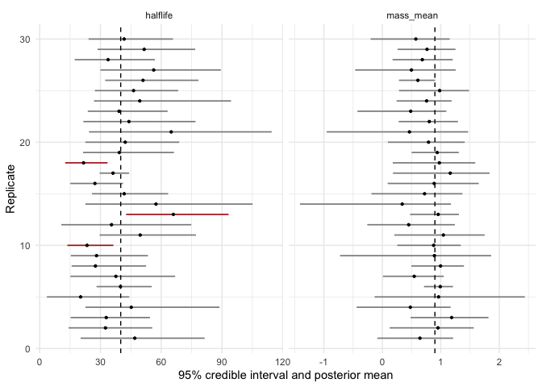
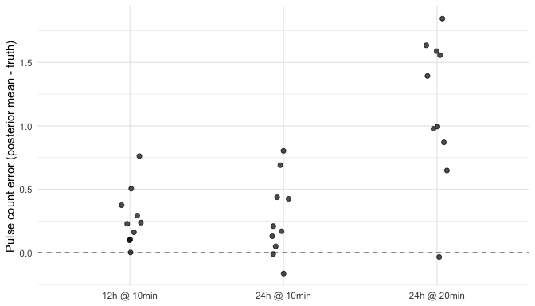

Before trusting a model with real data, it should be made to earn that trust
on data where the answer is known. A simulation study does two jobs at once:

1. **Trust** -- if we simulate from known truth and fit, do the posteriors
   recover that truth? Are 95% credible intervals honest (covering the truth
   about 95% of the time)?
2. **Design** -- before running a costly sampling protocol, which choices
   matter? Is a longer observation window worth more than denser sampling?

This vignette does both for the single-subject model, using the same
simulated design as the getting-started vignette so results carry across.
Everything here is a *demonstration-scale* study -- enough replicates to
read the pattern, small enough to precompute in about an hour. For a real
power analysis, take this code and raise the replicate counts.

## 1. The design and the truth

Each replicate simulates the getting-started series -- ten hours sampled
every 10 minutes, lognormal parameterization -- and fits it with the same
specification used there. The generating truth we hope to recover:

| Parameter | Truth |
|---|---|
| baseline | 2.5 |
| half-life | 40 |
| mass_mean (log scale) | 0.9 |
| width_mean (log variance scale) | 4.6 |
| mass_sd, width_sd (log scale) | 0.3 |


``` r
truth <- c(baseline = 2.5, halflife = 40, mass_mean = 0.9,
           width_mean = 4.6, mass_sd = 0.3, width_sd = 0.3)

simulate_one <- function(seed, num_obs = 60, interval = 10) {
  set.seed(seed)
  simulate_pulse(num_obs = num_obs, interval = interval, error_var = 0.005,
                 ipi_mean = 12, ipi_var = 10, ipi_min = 4,
                 pulse_distribution = "lognormal",
                 mass_mean = 0.9, mass_sd = 0.3,
                 width_mean = 4.6, width_sd = 0.3,
                 constant_halflife = 40, constant_baseline = 2.5)
}

make_spec <- function(pulse_count = 10) {
  pulse_spec(
    location_prior_type    = "strauss",
    prior_location_gamma   = 0.1,  prior_location_range = 30,
    prior_halflife_mean    = 38,   prior_halflife_var   = 1000,
    prior_baseline_mean    = 2.25, prior_baseline_var   = 100,
    prior_mean_pulse_count = pulse_count,
    sv_baseline_mean = 2.5, sv_halflife_mean = 42, sv_error_var = 0.005,
    pv_pulse_location = 5)
}

fit_one <- function(sim, seed, spec) {
  set.seed(seed)
  fit <- fit_pulse(data = sim$data, spec = spec,
                   iters = 250000, thin = 100, burnin = 25000,
                   verbose = FALSE)
  chain <- patient_chain(fit)
  params <- names(truth)
  data.frame(
    parameter  = c(params, "num_pulses"),
    truth      = c(truth, nrow(sim$parameters)),
    post_mean  = c(vapply(chain[params], mean, 0), mean(chain$num_pulses)),
    q2.5       = c(vapply(chain[params], quantile, 0, probs = 0.025),
                   quantile(chain$num_pulses, 0.025)),
    q97.5      = c(vapply(chain[params], quantile, 0, probs = 0.975),
                   quantile(chain$num_pulses, 0.975)),
    row.names  = NULL)
}
```

The helper returns, for one replicate, each parameter's posterior mean and
95% credible interval next to its generating truth. Note `num_pulses` is
compared against the pulse count that particular replicate actually drew,
not a fixed number -- the number of pulses is itself random in each
simulation.

## 2. Parameter recovery over repeated datasets

We run 30 replicates. (This chunk is precomputed offline via
`vignettes/precompute.R`; at production chain lengths it runs for roughly
half an hour.)


``` r
n_reps <- 30
spec <- make_spec()
recovery <- do.call(rbind, lapply(seq_len(n_reps), function(r) {
  sim <- simulate_one(seed = 3000 + r)
  cbind(rep = r, fit_one(sim, seed = 7000 + r, spec = spec))
}))
```

Bias, coverage, and interval width per parameter:


``` r
recovery$covered <- with(recovery, truth >= q2.5 & truth <= q97.5)
summary_tbl <- do.call(rbind, lapply(split(recovery, recovery$parameter),
  function(d) data.frame(
    parameter = d$parameter[1],
    truth     = round(mean(d$truth), 2),
    mean_est  = round(mean(d$post_mean), 3),
    bias      = round(mean(d$post_mean - d$truth), 3),
    coverage  = round(mean(d$covered), 2),
    ci_width  = round(mean(d$q97.5 - d$q2.5), 2),
    row.names = NULL)))
summary_tbl[order(match(summary_tbl$parameter,
                        c(names(truth), "num_pulses"))), ]
#>             parameter truth mean_est   bias coverage ci_width
#> baseline     baseline  2.50    2.536  0.036     0.83     1.11
#> halflife     halflife 40.00   40.981  0.981     0.90    46.32
#> mass_mean   mass_mean  0.90    0.781 -0.119     1.00     1.40
#> width_mean width_mean  4.60    4.001 -0.599     1.00     7.03
#> mass_sd       mass_sd  0.30    0.491  0.191     1.00     1.51
#> width_sd     width_sd  0.30    2.337  2.037     0.87     7.69
#> num_pulses num_pulses  5.87    6.462  0.595     1.00     3.43
```


``` r
show <- subset(recovery, parameter %in% c("halflife", "mass_mean"))
ggplot(show, aes(y = rep)) +
  geom_segment(aes(x = q2.5, xend = q97.5, yend = rep, color = covered),
               linewidth = 0.6) +
  geom_point(aes(x = post_mean), size = 0.8) +
  geom_vline(aes(xintercept = truth), linetype = "dashed") +
  scale_color_manual(values = c(`TRUE` = "grey55", `FALSE` = "firebrick"),
                     guide = "none") +
  facet_wrap(~ parameter, scales = "free_x") +
  labs(x = "95% credible interval and posterior mean", y = "Replicate") +
  theme_minimal()
```



Each horizontal segment is one replicate's 95% interval (red if it misses
the truth, the dashed line); dots are posterior means. With 30 replicates
the Monte Carlo error on a coverage estimate is about $\pm 4$ percentage
points ($\sqrt{0.95 \times 0.05 / 30} \approx 0.04$), so read the coverage
column as "consistent with 95%" or not, rather than as a precise number.

The pattern in the table reproduces the identifiability story told across
this vignette series, with the truth now known. The pulse-level means, the
pulse-to-pulse mass SD, and `num_pulses` are covered at or above nominal.
The baseline comes in at 83% -- below nominal even after allowing for Monte
Carlo error -- and the half-life at 90%: these are the two parameters that
trade off against each other in the troughs (the ridge examined in the
convergence vignette), and the simulation study puts a number on what that
ridge costs. And `width_sd`, which `identifiability_check()` flagged as
prior-dominated in the convergence vignette, here shows concretely what
that means: a posterior mean of 2.3 against a generating truth of 0.3, with
intervals spanning most of the Uniform(0, 10) prior. None of this is
visible from a single real-data fit -- which is exactly why the exercise is
worth running.

## 3. Which sampling design should you run?

The second use of simulation is prospective: before collecting data, compare
candidate protocols on simulated series. We compare three designs that cost
roughly the same number of blood draws:

- **12 h @ 10 min** -- 72 samples, short window, dense sampling
- **24 h @ 10 min** -- 144 samples, long window, dense sampling
- **24 h @ 20 min** -- 72 samples, long window, sparse sampling

The third design deliberately violates a resolution limit discussed in the
anatomy and priors vignettes: the true pulse width SD here is about 10
minutes ($\sqrt{e^{4.6}} \approx 10$), so with 20-minute sampling the
individual pulse shape falls below the sampling grid.


``` r
designs <- data.frame(
  design   = c("12h @ 10min", "24h @ 10min", "24h @ 20min"),
  num_obs  = c(72, 144, 72),
  interval = c(10, 10, 20))

n_reps_design <- 10
sweep <- do.call(rbind, lapply(seq_len(nrow(designs)), function(d) {
  spec_d <- make_spec(pulse_count = round(
    designs$num_obs[d] * designs$interval[d] / 120))
  do.call(rbind, lapply(seq_len(n_reps_design), function(r) {
    sim <- simulate_one(seed = 5000 + 100 * d + r,
                        num_obs = designs$num_obs[d],
                        interval = designs$interval[d])
    cbind(design = designs$design[d], rep = r,
          fit_one(sim, seed = 9000 + 100 * d + r, spec = spec_d))
  }))
}))
```


``` r
sweep$covered <- with(sweep, truth >= q2.5 & truth <= q97.5)
by_design <- do.call(rbind, lapply(split(sweep, sweep$design), function(d) {
  np <- subset(d, parameter == "num_pulses")
  hl <- subset(d, parameter == "halflife")
  wsd <- subset(d, parameter == "width_sd")
  data.frame(
    design            = d$design[1],
    pulse_count_MAE   = round(mean(abs(np$post_mean - np$truth)), 2),
    halflife_ci_width = round(mean(hl$q97.5 - hl$q2.5), 1),
    width_sd_ci_width = round(mean(wsd$q97.5 - wsd$q2.5), 2),
    row.names = NULL)
}))
by_design[match(designs$design, by_design$design), ]
#>                  design pulse_count_MAE halflife_ci_width width_sd_ci_width
#> 12h @ 10min 12h @ 10min            0.28              38.3              5.14
#> 24h @ 10min 24h @ 10min            0.31              31.0              1.52
#> 24h @ 20min 24h @ 20min            1.15              26.6              9.03
```


``` r
np <- subset(sweep, parameter == "num_pulses")
np$design <- factor(np$design, levels = designs$design)
ggplot(np, aes(design, post_mean - truth)) +
  geom_hline(yintercept = 0, linetype = "dashed") +
  geom_jitter(width = 0.08, height = 0, size = 1.8, alpha = 0.7) +
  labs(x = NULL, y = "Pulse count error (posterior mean - truth)") +
  theme_minimal()
```



Two comparisons matter. The two 10-minute designs isolate *window length*:
pulse-count accuracy is already good at 12 hours, and what the longer
window chiefly buys is the slow, global parameters -- the half-life
interval narrows appreciably with more hours of data. The two 24-hour
designs isolate *sampling density*, and there the resolution limit bites:
at 20-minute spacing the pulse-count error roughly quadruples (the model
systematically over-counts by one to two pulses, as the figure shows) and
the width-SD interval swells to nearly its full prior range -- the
pulse-level model is no longer identified. Note one trap in the table: the
sparse design also happens to produce the narrowest half-life interval. A
tight interval on one parameter is not evidence that a design works; judge
a design on the whole table, not a favorite column. With only 10
replicates per design these numbers are illustrative rather than
definitive -- but this is exactly the kind of question a scaled-up version
of this loop, run on *your* candidate protocols, can settle before anyone
is asked for blood.

## 4. Practical notes

- **Scale the replicates to the claim.** Thirty replicates checks for gross
  miscalibration; distinguishing 93% from 95% coverage needs thousands. The
  loops above are deliberately plain `lapply` code so they are easy to lift,
  parallelize, and extend.
- **Keep the fits honest.** All fits here use production chain lengths
  (250,000 iterations). Cutting iterations to speed up a simulation study
  quietly mixes Monte Carlo error from short chains into the comparison --
  if a cheaper study is needed, reduce replicates before chain length.
- **Compare like with like.** The number of true pulses differs across
  replicates, so `num_pulses` is judged against each replicate's own truth,
  and the pulse-count prior is scaled to each design's window length.
- **Runtime.** One 60-observation fit at production length takes on the
  order of a minute; this vignette's 60 fits precompute in about an hour.
  Time one fit on your machine before designing a larger grid.

## Where next

The final vignette in the series turns from models to workflow: extracting
tidy posterior chains with `patient_chain()` and `pulse_chain()` and
building custom summaries and posterior-predictive checks from them.
