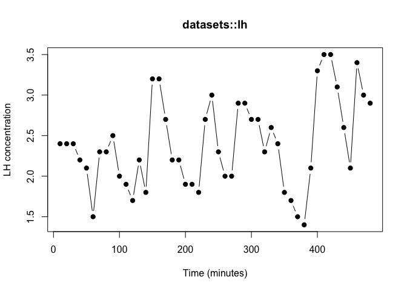
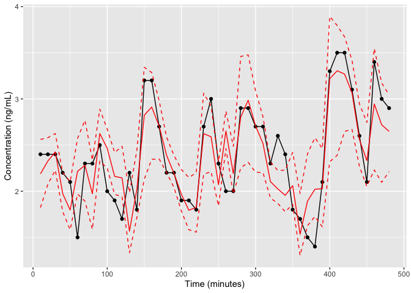
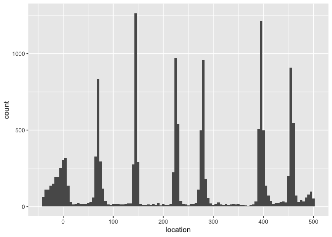

The other vignettes fit simulated series, where the truth is known. Here we turn
the model loose on real data. R ships with `lh` (in the **datasets** package):
luteinizing hormone measured in 48 blood samples taken at 10-minute intervals
from a human female, from Diggle (1990), *Time Series: A Biostatistical
Introduction*. LH is released from the pituitary in discrete pulses, so this
classic teaching series is a natural real-world test for the deconvolution model.

## The data

We reshape the built-in series into the `time`/`concentration` frame that
`fit_pulse()` expects. The samples are 10 minutes apart, so the 48 observations
span 480 minutes.


``` r
data(lh)                                         # base-R datasets::lh
lh_dat <- data.frame(time          = seq_along(lh) * 10,   # minutes
                     concentration = as.numeric(lh))
str(lh_dat)
#> 'data.frame':	48 obs. of  2 variables:
#>  $ time         : num  10 20 30 40 50 60 70 80 90 100 ...
#>  $ concentration: num  2.4 2.4 2.4 2.2 2.1 1.5 2.3 2.3 2.5 2 ...
plot(lh_dat$time, lh_dat$concentration, type = "b", pch = 19,
     xlab = "Time (minutes)", ylab = "LH concentration",
     main = "datasets::lh")
```



The series hovers around 2 with several clear excursions upward -- candidate
pulses for the model to recover.

## A specification for LH

We adapt the single-subject specification to this hormone and window: the
baseline prior sits near the observed troughs, the half-life prior is centred at
a physiologically reasonable 40 minutes, and we expect on the order of six pulses
across the 480-minute window. Real assay data is noisier than the simulations in
the other vignettes, so we give the error a slightly looser starting value.

Real data is where the priors start to earn their keep. The other vignettes fit
simulated series generated from the model's own assumptions, and there the
package defaults work fine. Here they do not: run this series with the default
vague width prior and the sampler drives pulse width down to a standard deviation
of under two minutes -- far narrower than the ten-minute sampling grid can
resolve -- and the half-life wanders up into the mid-fifties with an effective
sample size in the low teens. The data cannot pin those parameters down on their
own, so the prior has to.

We therefore add two genuinely informative priors, both justified by physiology
rather than by the fit we want. Pulse width is centred at `4.0` on the log
variance scale, a pulse standard deviation of about
$\sqrt{e^{4.0}} \approx 7$ minutes, with a tight variance so the sampler stays in
a range the sampling schedule can actually resolve. The half-life prior is
tightened from a variance of 1000 to 100, because LH elimination half-life is
genuinely well characterized at around 40 minutes and there is no reason to
pretend otherwise. Pulse mass is still left at its default.

Note that mass and width are on the **log** scale throughout, since `pulse_spec()`
uses the lognormal parameterization; the summaries below report them that way.


``` r
spec <- pulse_spec(
  location_prior_type    = "strauss",
  prior_location_gamma   = 0.1,  prior_location_range = 30,
  prior_halflife_mean    = 40,   prior_halflife_var   = 100,
  prior_width_mean       = 4.0,  prior_width_var      = 1.0,
  prior_baseline_mean    = 1.8,  prior_baseline_var   = 100,
  prior_mean_pulse_count = 6,
  sv_baseline_mean = 1.8, sv_halflife_mean = 42, sv_error_var = 0.01,
  pv_pulse_location = 5)
```

## Fit

We run a single production-length chain. (This chunk is precomputed offline via
`vignettes/precompute.R`, so the vignette itself builds quickly.)


``` r
set.seed(2026)
fit <- fit_pulse(data = lh_dat, spec = spec,
                 iters = 250000, thin = 100, burnin = 25000, verbose = FALSE)
#> Location prior is: strauss
#> mcmc iterations = 250000
#> thin = 100
#> burnin = 25000
```

## Does the model fit the data?


``` r
bp_predicted(fit, predict(fit, cred_interval = 0.9))
```



The fitted concentration (red) follows the observed series (black) through its
peaks and troughs, and the 90% credible band covers the data. The model
reproduces a real LH profile, not just simulated ones.

## What did it find?


``` r
pc <- patient_chain(fit)
round(colMeans(pc[, c("num_pulses", "baseline", "halflife",
                      "mass_mean", "width_mean")]), 2)
#> num_pulses   baseline   halflife  mass_mean width_mean 
#>       6.55       1.41      39.55       0.13       3.32
```


``` r
round(prop.table(table(pc$num_pulses)), 3)
#> 
#>     1     2     3     4     5     6     7     8     9    10    11 
#> 0.026 0.042 0.053 0.055 0.036 0.033 0.434 0.254 0.057 0.008 0.002
```


``` r
bp_location_posterior(fit)
```



The posterior concentrates on seven to eight pulses, with a baseline sitting just
below the observed troughs and an elimination half-life near 40 minutes -- both
physiologically sensible for LH. Remember that `mass_mean` and `width_mean` are
log-scale: the fitted width corresponds to a pulse standard deviation of roughly
five minutes, and the fitted mass to a median pulse mass a little above one. The
location posterior places those pulses at tight, well-separated positions that
line up with the visible peaks in the series; a couple sit at the edges of the
window, which is the model's way of accounting for secretion just before or after
the sampling period.

The pulse-count distribution also shows a smaller secondary cluster down at one
to four pulses. That is the sampler occasionally collapsing to a "mostly
baseline" explanation of the series before climbing back out, and it is a
reminder that the pulse count here is genuinely uncertain rather than a single
crisp answer.

## Caveats

This is a single chain shown for a quick demonstration. Before drawing firm
conclusions you should assess convergence properly -- run several chains and
check the effective sample size and the Gelman-Rubin statistic, as described in
the convergence-diagnostics vignette. On this series the baseline is the slowest
parameter to mix, and the bimodal pulse count above is exactly the situation
where a Gelman-Rubin statistic across several chains is worth more than any
single-chain summary.

More generally, the contrast with the simulated vignettes is the real lesson.
Data generated from the model is kind to vague priors; a real assay series,
sampled every ten minutes for eight hours, is not. Deconvolution asks a lot of
48 observations, and the sampling schedule sets a hard limit on what can be
recovered no matter how long you run the chain.
